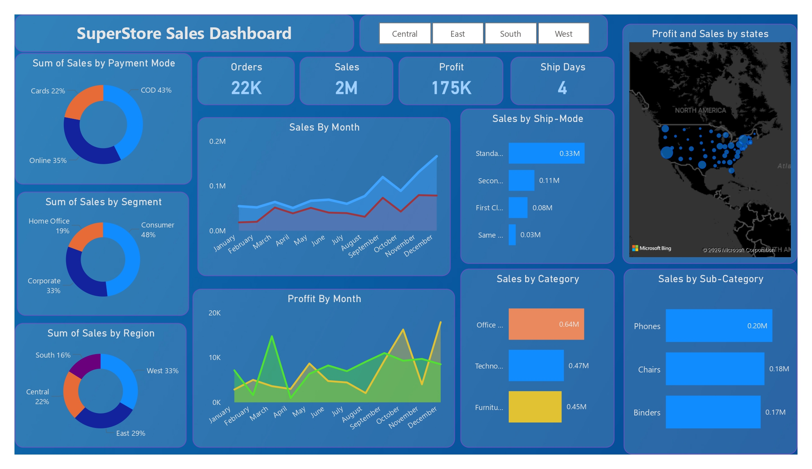

# 📊 SuperStore Sales Dashboard (Power BI Project)

## 📌 Project Overview
The SuperStore Sales Dashboard is an interactive Business Intelligence project built using Microsoft Power BI.
It provides detailed insights into sales performance, profit trends, customer segments, regional distribution, and includes a 15-day sales forecast to support data-driven decision-making.

## 📷 Dashboard Preview

## 🛠 Tools Used
- Power BI
- Excel
- Data Cleaning
- DAX
- Data Modeling
- Forecasting Techniques

## 📈 Key Insights
- Sales by Category and Sub-Category
- Sales by Region and State
- Sales by Ship Mode
- Sales by Payment Mode
- Monthly Sales & Profit Analysis
- Segment-wise Sales Distribution
- 15-Day Sales Forecast

## 📊 Key Metrics
- Total Sales: 2M+
- Total Profit: 175K+
- Total Orders: 22K+
- Average Ship Days: 4

  
